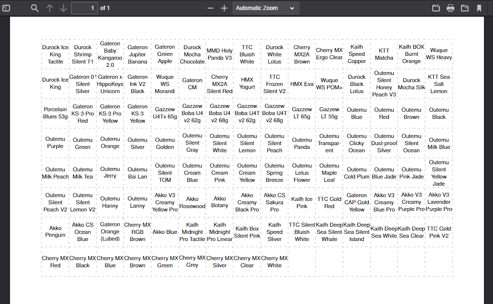

# Keycap Label PDF Generator

* This python script generates a PDF with a grid of keycap labels. 
* You can change the fixed height, fixed width, and font size of each cell in the variables at the top of the script.

* These labels are intended for relegendable (a.k.a. double layer) keycaps. 

    * [Here is an example](https://a.co/d/9BHkL2X)

        

* The generated PDF looks like this.

    
